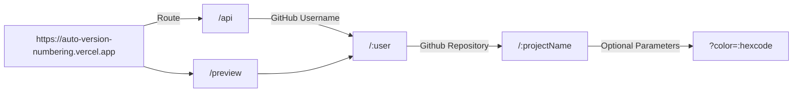

# Automatic Version Numbering
 NodeJS API service for generating version number `.svg` images for GitHub projects.

 

## Routing

|`https://auto-version-numbering.vercel.app`|`/api` OR `/preview`|`/:user`|`/:projectName`|`?color=:hexcode`|
|:---:|:---:|:---:|:---:|:---:|
|Host domain|Use `/api` for use-cases, `/preview` is a HTML webpage previewing the `/api` `.svg` response.|The target GitHub repository owner username|The target GitHub repository name|Hexcode to customise the color of the image (optional, default `d5008f`)|
